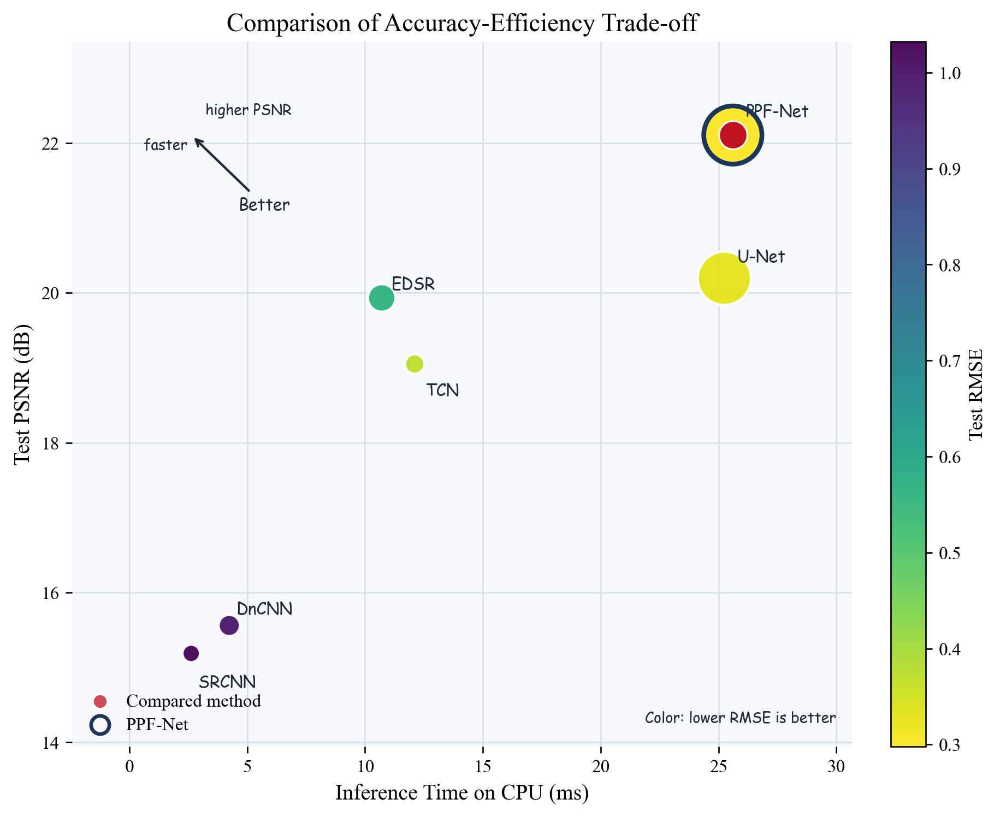

# PPF-Net

PPF-Net is a research codebase for fast terahertz reflectance spectrum reconstruction.

The current repository focuses on:

- THz-only reflectance spectral priors
- RGB-guided multimodal fusion
- pixel-wise and patch-wise spectral reconstruction
- full-cube rebuilding, CSV export, image-map generation, and reconstruction analysis

## Current Mainline

The strongest line in this repository is:

1. Stage 1: train a THz-only FS pixel-wise spectral reconstruction model
2. Stage 2: train a paired RGB + FS reconstruction model
3. upgrade the fusion unit from single-pixel conditioning to local patch / local-region fusion
4. compare against FS-only, interpolation baselines, and extra learning baselines such as TCN

The current experiments show that the main gain comes from **patch / local-region multimodal fusion**, rather than simple RGB concatenation alone.

## Experimental Comparison

The figure below summarizes the trade-off between reconstruction quality and efficiency across the main baselines in this repository.



## Repository Layout

- `ppfnet/`
  Main Python package.
- `scripts/`
  Data preparation, training, reconstruction, visualization, analysis, and benchmark scripts.
- `outputs/`
  Checkpoints, logs, reconstructed CSV files, image maps, and experiment summaries.
- `datasets/`
  RGB images and raw THz CSV data.

## Installation

Install the common dependencies used in the project:

```powershell
pip install numpy scipy pillow matplotlib torch torchvision
```

Install the package in editable mode if needed:

```powershell
pip install -e .
```

## Recommended Workflow

The commands below follow the experiment folders currently used in this repository, such as `outputs/stage1_*` and `outputs/stage2_*`.

### 1. Train the Stage-1 THz-only teacher

```powershell
& D:/env/YOLO/python.exe scripts/train_stage1_pixel_spectral_unet.py `
  --modality fs `
  --train-manifest outputs\stage1\splits\train_pairs.csv `
  --val-manifest outputs\stage1\splits\val_pairs.csv `
  --test-manifest outputs\stage1\splits\test_pairs.csv `
  --output-dir outputs\stage1_pixel_fs `
  --epochs 80 `
  --batch-size 256 `
  --amp
```

### 2. Train the Stage-2 FS-only baseline

```powershell
& D:/env/YOLO/python.exe scripts/train_stage2_fs_only_baseline.py `
  --train-manifest outputs\stage2\splits\train_pairs.csv `
  --val-manifest outputs\stage2\splits\val_pairs.csv `
  --test-manifest outputs\stage2\splits\test_pairs.csv `
  --output-dir outputs\stage2_fs_only_baseline_random `
  --epochs 800 `
  --batch-size 2 `
  --max-pixels-per-sample 512 `
  --amp
```

### 3. Train the final RGB + FS patch model

```powershell
& D:/env/YOLO/python.exe scripts/train_stage2_rgb_fs_patch_student.py `
  --train-manifest outputs\stage2\splits\train_pairs.csv `
  --val-manifest outputs\stage2\splits\val_pairs.csv `
  --test-manifest outputs\stage2\splits\test_pairs.csv `
  --teacher-checkpoint outputs\stage1_pixel_fs\checkpoints\stage1_pixel_spectral_unet_best.pt `
  --output-dir outputs\stage2_rgb_fs_patch_student `
  --epochs 200 `
  --batch-size 64 `
  --rgb-patch-size 64 64 `
  --thz-patch-size 7 `
  --max-pixels-per-sample 512 `
  --teacher-weight 0 `
  --amp
```

### 4. Reconstruct the test set and export CSV/image maps

FS-only baseline:

```powershell
& D:/env/YOLO/python.exe scripts/reconstruct_stage2_fs_only_testset.py `
  --manifest outputs\stage2\splits\test_pairs.csv `
  --checkpoint outputs\stage2_fs_only_baseline_random\checkpoints\stage2_fs_only_baseline_best.pt `
  --output-dir outputs\stage2_fs_only_baseline_random\predictions\test_reconstruction `
  --batch-size 512
```

Patch model:

```powershell
& D:/env/YOLO/python.exe scripts/reconstruct_stage2_patch_testset.py `
  --manifest outputs\stage2\splits\test_pairs.csv `
  --checkpoint outputs\stage2_rgb_fs_patch_student\checkpoints\stage2_rgb_fs_patch_student_best.pt `
  --output-dir outputs\stage2_rgb_fs_patch_student\predictions\test_reconstruction `
  --batch-size 128
```

### 5. Analyze spectral and image-map metrics

```powershell
& D:/env/YOLO/python.exe scripts/analyze_thz_reconstruction.py `
  --prediction-root outputs\stage2_rgb_fs_patch_student\predictions\test_reconstruction `
  --output-dir outputs\stage2_rgb_fs_patch_student\predictions\test_reconstruction\analysis
```

### 6. Benchmark model size and inference speed

```powershell
& D:/env/YOLO/python.exe scripts/benchmark_inference_models.py `
  --checkpoints `
  outputs\stage1_pixel_fs\checkpoints\stage1_pixel_spectral_unet_best.pt `
  outputs\stage2_fs_only_baseline_random\checkpoints\stage2_fs_only_baseline_best.pt `
  outputs\stage2_tcn_baseline\checkpoints\stage2_tcn_baseline_best.pt `
  outputs\stage2_rgb_fs_student_local_global\checkpoints\stage2_rgb_fs_student_best.pt `
  outputs\stage2_rgb_fs_patch_student\checkpoints\stage2_rgb_fs_patch_student_best.pt `
  --warmup-iters 20 `
  --benchmark-iters 100 `
  --batch-size 128 `
  --pixels-per-sample 128 `
  --output-csv outputs\model_benchmark.csv `
  --output-json outputs\model_benchmark.json
```

## External Comparison Baselines

The repository currently supports:

- traditional interpolation baselines
  - linear interpolation
  - PCHIP
  - cubic spline
- learning-based single-modality baselines
  - Stage-2 FS-only baseline
  - Stage-2 TCN baseline
- multimodal models
  - earlier pixel-level RGB + FS fusion
  - final patch-based RGB + FS fusion

Interpolation baselines do not require training. They directly reconstruct the masked test set:

```powershell
& D:/env/YOLO/python.exe scripts/reconstruct_stage2_interpolation_testset.py `
  --manifest outputs\stage2\splits\test_pairs.csv `
  --method linear `
  --output-dir outputs\stage2_interpolation_linear\predictions\test_reconstruction `
  --batch-size 512
```

## Documentation

- Chinese overview: [README_CN.md](./README_CN.md)
- English script reference: [SCRIPTS_README.md](./SCRIPTS_README.md)
- Chinese script reference: [SCRIPTS_README_CN.md](./SCRIPTS_README_CN.md)
